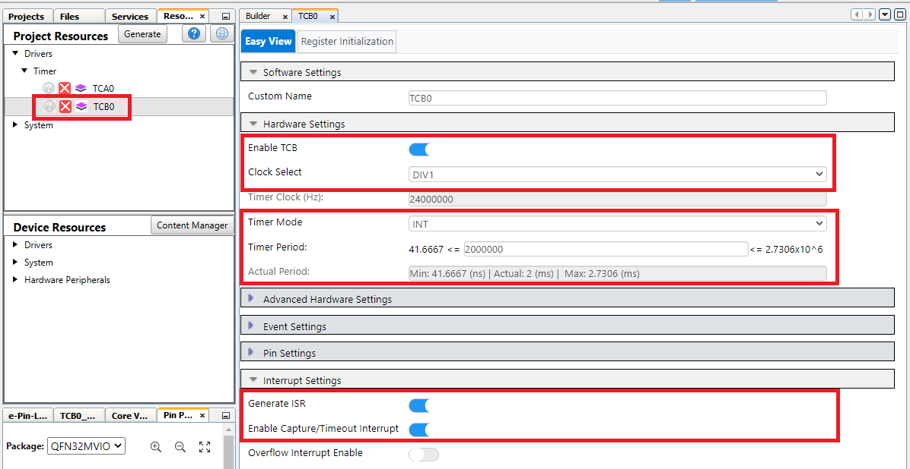

<!-- Please do not change this html logo with link -->

<a href="https://www.microchip.com" rel="nofollow"></a>

# Pin Multiplexing in two different examples using AVR64DD32 Microcontroller generated with MCC Melody

The AVR® DD family features fairly low pin count devices. The examples in this repository show how to get the most out of the pins and implements techniques to decrease the number of pins needed for usual applications such as LED control and button readings.

For the applications where a large amount of pins is required, the techniques presented in this project will be very useful, so that a bigger device is not needed.

<br>The repository contains two MPLAB® X projects:

- [1. Charlieplexing](#1-charlieplexing) In this project, an array of LEDs will be controlled with a fewer number of I/O pins than the LEDs by using a technique of multiplexing based on tri-state logic.
- [2. Single pin LED and Button](#2-single-pin-led-and-button) In this project, an LED and a button are connected to a single GPIO. The LED will blink with a period of 1s and the button will be used to light another LED when the button is pressed.

Both code examples are written in a library-oriented manner so that it is easy to reuse and configure the code to work with different number of pins/LEDs.

## Related Documentation

More details and code examples on the AVR64DD32 can be found at the following links:

- [AVR64DD32 Product Page](https://www.microchip.com/wwwproducts/en/AVR64DD32)
- [AVR64DD32 Code Examples on GitHub](https://github.com/microchip-pic-avr-examples?q=AVR64DD32)
- [AVR64DD32 Project Examples in START](https://start.atmel.com/#examples/AVR64DD32CuriosityNano)

## Software Used

- [MPLAB® X IDE](http://www.microchip.com/mplab/mplab-x-ide) v6.00 or newer
- [MPLAB® XC8](http://www.microchip.com/mplab/compilers) v2.36 or newer
- [AVR-Dx Series Device Pack](https://packs.download.microchip.com/) v2.1.152 or newer
- [MPLAB® Code Configurator Melody](https://www.microchip.com/en-us/tools-resources/configure/mplab-code-configurator/melody) core 2.1.12 or newer

## Hardware Used

- The AVR64DD32 Curiosity Nano Development Board is used as test platform.
  <br>
  <br>
- Six LEDs
- One button
- Six resistors:
    - 3x 100 Ohm
    - 2x 330 Ohm
    - 1x 2k2 Ohm
    - 1x 10k Ohm
- Jumper wires

## Operation

To program the Curiosity Nano board with this MPLAB® X project, follow the steps provided in the [How to Program Curiosity Nano board](#how-to-program-curiosity-nano-board) chapter.<br><br>

## 1. Charlieplexing

This purpose of this project is to individually control an array of LEDs with fewer number of pins than the LEDs. For this demo, six LEDs will be controlled with three GPIO pins, but the example is scalable for a larger number of pins and LEDs.

The charlieplexing technique uses the tri-state logic properties of microcontroller pins: `Digital output - state LOW`, `Digital output - state HIGH` and `Digital input`. When the pin is in Digital Input state, it has high-impedance, which "disconnects" that pin from the circuit diagram, meaning that little or no current will flow through it.

When using charlieplexing, the relation between the number of pins used and the maximum number of driven LEDs is according to the following table:

| Pins |    Driven LEDs    |
| :--: | :---------------: |
|  1   |         0         |
|  2   |         2         |
|  3   |         6         |
|  4   |        12         |
|  5   |        20         |
|  6   |        30         |
|  7   |        42         |
|  8   |        56         |
|  9   |        72         |
|  10  |        90         |
|  n   | n<sup>2</sup> - n |

By using charlieplexing, only a single LED can be lit at a moment of time without turning on other LEDs. To create the illusion that two or more LEDs are lit at the same time, they need to be lit alternantly, in tight time slots. In a time slot, a single LED will be briefly lit, then in the next time slot, another LED will be briefly lit, and the cycle repeats. If the time slots repeat fast enough, the LEDs will appear lit at the same time to the human eye, because of persistence of vision.

If a large number of LEDs is controlled using the charlieplexing technique, the time slot duration for each LED has to be small enough so that the flickering of LEDs from the refresh rate does not become noticeable. Also, when working with a large number of LEDs, other significant problems can be: The power drained by the LEDs, the latency time of the LEDs and the speed of the microcontroller.

The setup schematic is presented below.

<br>

To light LED3 only, set `PA3 - HIGH` and `PA4 - LOW`. If PA2 is digital output and is high, LED5 will also be lit. Also, if PA2 is digital output and is low, LED2 will also be lit. This is solved by utilizing the tri-state logic, and making `PA2 - INPUT`. With this configuration, only LED3 will be lit.

In this example, the time slot operation was implemented using the Timer/Counter Type B - instance 0 (TCB0) configured in Periodical Interrupt mode. The timer generates a time-out interrupt every 1 ms. The interrupt handler iterates through all the LED arrays and decides whether the current LED must to be turned on or not.

### 1.1 Refresh Rate

If the refresh rate of the LED array is slower than 30 Hz, the LEDs will not appear lit when they are intended to be lit. Instead, the LEDs will flicker because the refresh rate is not high enough, and the human eye can distinguish the fast blinking of the LEDs. To compute the LED array refresh rate, the following equation is used:

```
Refresh_rate = 1 / (Number_of_LEDs * Timer_interrupt_period)
```

For this example, six LEDs are used in the array and the TCB0 periodical interrupt is set to 1 ms. Thus, the refresh rate of the LED array for this example is 166.66 Hz, so the human eye will not distinguish the LEDs flickering.

This application will display an animation through the LED array as follows:

```
x - LED OFF
0 - LED ON

x x x x x x
short_delay
0 x x x x x
short_delay
0 0 x x x x
short_delay
0 0 0 x x x
short_delay
0 0 0 0 x x
short_delay
0 0 0 0 0 x
short_delay
0 0 0 0 0 0
short_delay
0 0 0 0 0 x
short_delay
0 0 0 0 x x
short_delay
0 0 0 x x x
short_delay
0 0 x x x x
short_delay
0 x x x x x
short_delay
x x x x x x
```

### 1.2 Library Implementation Details

#### 1.2.1 Overview

This library is designed to implement the charlieplexing technique with a configurable number of pins and LEDs. The following actions are possible:

- turn `ON` an LED from the LED array
- turn `OFF` an LED from the LED array
- toggle a specific LED from the LED array

The TCB0 periodical interrupt is used to implement the time slot operation. The duration of the this periodical interrupt can be modified using MCC.

#### 1.2.2 Functions

##### `CharlieInit`

- Prototype:
  <br> `void CharlieInit(void);`

- Description:
  <br> Function needed for initializing the multiplexing.

- Parameters:
  <br> N/A

- Return Value:
  <br> N/A

- Example:
  <br> CharlieInit();

##### `CharlieOn`

- Prototype:
  <br> `void CharlieOn(uint8_t id);`

- Description:
  <br> Turn ON the current LED.

- Parameters:
  <br> uint8_t id with values from 0 to the LEDS_NUMBER - 1. This number represents the LED index as defined in the header file.

- Return Value:
  <br> N/A

- Example:
  <br> CharlieOn(0);

##### `CharlieOff`

- Prototype:
  <br> `void CharlieOff(uint8_t id);`

- Description:
  <br> Turn OFF the current LED.

- Parameters:
  <br> uint8_t id with values from 0 to the LEDS_NUMBER - 1. This number represents the LED index as defined in the header file.

- Return Value:
  <br> N/A

- Example:
  <br> CharlieOff(0);

##### `CharlieToggle`

- Prototype:
  <br> `void CharlieToggle(uint8_t id);`

- Description:
  <br> Toggles the current LED

- Parameters:
  <br> uint8_t id with values from 0 to the LEDS_NUMBER - 1. This number represents the LED index as defined in the header file.

- Return Value:
  <br> N/A

- Example:
  <br> CharlieToggle(0);

##### `CharlieAll`

- Prototype:
  <br> `void CharlieAll(bool *pData);`

- Description:
  <br> Modifies the current boolean LED array with a user-defined one.

- Parameters:
  <br> bool \*pData - the user-define boolean LED array.

- Return Value:
  <br> N/A

- Example:
  <br> CharlieAll(LED_demo);

##### `LED_demo`

- Prototype:
  <br> `static void LED_demo(void);`

- Description:
  <br> Implements an animations for the LED array. It uses the CharlieAll functions.

- Parameters:
  <br> N/A

- Return Value:
  <br> N/A

- Example:
  <br> LED_demo();

#### 1.2.3 User Callback Function

##### `CharlieHandler`

- Prototype:
  <br> `void CharlieHandler(void);`

- Description:
  <br> This function needs to be called periodically at fixed intervals.

- Parameters:
  <br> N/A

- Return Value:
  <br> N/A

### 1.3 Library Usage Examples

The library was designed in such a way that the user can configure the following:

- The number of pins
- The number of LEDs
- The pins the microcontroller uses
- The anode and cathode connections for the LEDs
- The time slot duration (TCB0 periodical interrupt duration)

#### 1.3.1 Configuring the Pins

The pins used by the application can be configured by modifying the `pins_data` variable from the `config_charliplexing_config.h` header file. For this example, the following code snippet presents the default configuration with the pins PA2, PA3, and PA4:

```
static const drive_t pins_data[] = {
    {&PORTA, PIN2_bm},      /* drive pin 0 */
    {&PORTA, PIN3_bm},      /* drive pin 1 */
    {&PORTA, PIN4_bm}       /* drive pin 2 */
};
```

For example, in this default configuration, the pins used by the application are:

- `drive pin 0 - PA2`
- `drive pin 1 - PA3`
- `drive pin 2 - PA4`

#### 1.3.2 Configuring the LEDs

The anode and cathode connections for the LEDs are also configurable by modifying the `charlie_data` variable from the `config_charlieplexing.h` header file. For this example, the connections shown in the schematic are done using the following configuration:

```
/* LEDs assignment:
 *  {anode, cathode}   */
static const charlie_t charlie_data[] = {
    {0, 1},     /* LED0 */
    {1, 0},     /* LED1 */
    {1, 2},     /* LED2 */
    {2, 1},     /* LED3 */
    {0, 2},     /* LED4 */
    {2, 0}      /* LED5 */
};
```

For example, in this default configuration, the LED0's anode is `drive pin 0` (which in the default configuration is PA2) and the LED0's cathode is `drive pin 1` (which in the default configuration is PA3).

**Note:** The default configurations are made to correspond to the connections from the schematic.

#### 1.3.3 Configuring the Time Slot Duration

The duration of a time slot is controlled by the TCB0 periodical interrupt which can be configured by using MCC. To configure the duration of the time slot, open MCC and go to _Project Resources → Peripherals → TCB0. On Easy View_, configure the Timer Period as desired. The MCC configuration for this application is presented below:

<br>

After updating the timer period, save the MCC configuration and click **Generate**.

#### 1.3.4 Setting the Callback Function

The following line of code shows how to set the TCB0 interrupt handler by using the MCC-generated API:

```
TCB0_CaptureCallbackRegister(CharlieHandler);
```

### 1.4 Setup

The following configurations must be made for this project:

- Oscillator Frequency Selection: 24 MHz

The Clock Control (CLKCTRL) MCC Configuration is presented in the figure below.
<br>

- Global Interrupt enabled

The Interrupt Manager MCC Configuration is presented in the figure below.
<br>

- TCB0:
  - Clock Select: DIV2
  - Timer mode: Periodic Interrupt
  - Timer period: 1 ms
  - Capture/Time-out Interrupt setting enabled
  - Generating ISR enabled
  - Peripheral enabled

The TCB0 MCC Configuration is presented in the figure below.
<br>

The initial pin configurations are presented in the table below.

| Pin | Configuration |
| :-: | :-----------: |
| PA2 | Digital Input |
| PA3 | Digital Input |
| PA4 | Digital Input |

**Note:** These are the default pins used in this project, but they can be configured by using the `config_charlieplexing.h` header file.

### 1.5 Demo

For the demo, all the LEDs are turned on and off, one by one:

<br>

### 1.6 Summary

This code example shows how to implement the charlieplexing technique using an AVR64DD32 Curiosity Nano Board to control six LEDs with the help of three GPIO pins.

The same technique can be used to control even more LEDs and the code is written so that changing the number of LEDs and the pins can be done with minimal effort, just by changing the configuration header.<br>
- - -
## Charlieplexing - Menu
- [Back to 1. Charlieplexing](#1-charlieplexing)
    - [Back to 1.1 Refresh Rate](#11-refresh-rate)
    - [Back to 1.2 Library Implementation Details](#12-library-implementation-details)
        - [Back to 1.2.1 Overview](#121-overview)
        - [Back to 1.2.2 Functions](#122-functions)
        - [Back to 1.2.3 User Callback Functions](#123-user-callback-function)
    - [Back to 1.3 Library Usage Examples](#13-library-usage-examples)
        - [Back to 1.3.1 Configuring The Pins](#131-configuring-the-pins)
        - [Back to 1.3.2 Configuring The LEDs](#132-configuring-the-leds)
        - [Back to 1.3.3 Configuring The Time Slot Duration](#133-configuring-the-time-slot-duration)
        - [Back to 1.3.4 Setting The Callback Function](#134-setting-the-callback-function)
    - [Back to 1.4 Setup](#14-setup)
    - [Back to 1.5 Demo](#15-demo)
    - [Back to 1.6 Summary](#16-summary)
- [Back to top](#pin-multiplexing-in-two-different-examples-using-avr64dd32-microcontroller-generated-with-mcc-melody)
- - - 

## 2. Single pin LED and Button

The purpose of this project is to control and use both an LED and a button with a single GPIO pin.

This is done by using the pin as output most of the time, but periodically, for a short amount of time, the pin is used as input to check the button state. The button check is triggered by a periodical interrupt generated by the TCB0 peripheral. The GPIO pin is then again used as digital output to drive the LED.

For demonstration purpose, when the button is pressed, a second LED is lit.

A debouncing mechanism is implemented for the button by using a software counter that increases when the the button state is different from the previous saved button state. This counter can increase once in every TCB0 interrupt. If the counter reaches a threshold value (that can be configured by the user with the help of a macro definition), the button state is considered stable, and the button press is detected. For this example, the default threshold used is `10`, so the debounce time for the button is `2 ms * 10 = 20 ms`.

The setup schematic is presented below.

<br>

| Resistor |  Value   |
| :------: | :------: |
|    R1    | 10 kOhm  |
|    R2    | 330 ohm  |
|    R3    | 2.2 kOhm |
|    R4    | 330 ohm  |

**Important:** To properly scan the button on the common GPIO pin, the voltage on the pin in the input state has to be higher than a certain threshold (for the AVR64DD32 this threshold is around 1.81V). The voltage on the pin in the input state is computed following the equation below:

<br>

**Note:** Red LEDs have the lowest forward voltage of all colors, therefore if a red LED is used for the LED1, the R1 and R2 resistors need to be adjusted to obtain a proper voltage on the common GPIO pin. For the red LEDs, the usual forward voltage is around 1.7V. A proper set of values for the red LEDs is `R1 = 6.8 kOhm` and `R2 = 1 kOhm`, thus obtaining a voltage on the common GPIO pin of around 1.9V (value that is above the threshold).

For this example, the LED connected to the common GPIO pin will blink with a period of one second (using the interrupts from TCA0 peripheral) and pressing the SWITCH connected to the common GPIO pin will turn ON the other LED.

### 2.1 Implementation Details

#### 2.1.1 Overview

This library is designed to implement a multiplexing technique for a signal GPIO pin with a configurable number of pins. The following actions are possible:

- Use a pin as digital output (turn low, turn high, toggle)
- Use a pin as digital input

The TCB0 periodical interrupt is used to implement the GPIO pins scanning. The duration of this periodical interrupt can be modified using MCC.

**Note:** Modifying the TCB0 timer period will also modify the debounce time for the buttons.

#### 2.1.2 Functions

##### `single_pins_init`

- Prototype:
  <br> `void single_pins_init(void);`

- Description:
  <br> This function initializes the single pins array that contains their `state`, `current_state` and `debounce_counter` with their default values.

- Parameters:
  <br> N/A

- Return Value:
  <br> N/A

- Example:
  <br> `single_pins_init();`

##### `multiplexed_pin_set_low`

- Prototype:
  <br> `input_output_ret_t multiplexed_pin_set_low(uint8_t index);`

- Description:
  <br> This function sets the selected pin low.

- Parameters:

  - uint8_t index - the index used to identify the pin from the user configured array.

- Return Value:

  - input_output_ret_t result.

- Example:
  <br> `multiplexed_pin_set_low(0);`

##### `multiplexed_pin_set_high`

- Prototype:
  <br> `input_output_ret_t multiplexed_pin_set_high(uint8_t index);`

- Description:
  <br> This function sets the selected pin high.

- Parameters:

  - uint8_t index - the index used to identify the pin from the user configured array.

- Return Value:

  - input_output_ret_t result.

- Example:
  <br> `multiplexed_pin_set_high(0);`

##### `multiplexed_pin_toggle`

- Prototype:
  <br> `input_output_ret_t multiplexed_pin_toggle(uint8_t index);`

- Description:
  <br> This function toggles the selected pin.

- Parameters:

  - uint8_t index - the index used to identify the pin from the user configured array.

- Return Value:

  - input_output_ret_t result.

- Example:
  <br> `multiplexed_pin_toggle(0);`

##### `multiplexed_pin_read`

- Prototype:
  <br> `input_output_ret_t multiplexed_pin_read(uint8_t index, uint8_t *out);`

- Description:
  <br> This function toggles the selected pin.

- Parameters:

  - uint8_t index - the index used to identify the pin from the user configured array.
  - uint8_t \*out - used to save the state of the common GPIO pin.

- Return Value:

  - input_output_ret_t result.

- Example:
  <br> `input_output_ret_t ret = multiplexed_pin_read(0, &pin_value);`

#### 2.1.3 User Callback Function

##### `multiplexed_pin_input_handler`

- Prototype:
  <br> `void multiplexed_pin_input_handler(void);`

- Description:
  <br> This interrupt handler sets the multiplexed pins in the input state, reads the pins state (the buttons state) and saves them inside the `current_state` field from the pins array. Inside this interrupt handler is also implemented a debouncing mechanism for the buttons. If the Debouncing condition is accomplished, the `current_state` is also saved into the `state` field from the pins array.

- Parameters:
  <br> N/A

- Return Value:
  <br> N/A

##### `multiplexed_pin_output_handler`

- Prototype:
  <br> `void multiplexed_pin_output_handler(void);`

- Description:
  <br> This interrupt handler is toggling the multiplexed pin PA3 (for this example). This is utilized just for this use-case, the user may configure or redesign it.

- Parameters:
  <br> N/A

- Return Value:
  <br> N/A

#### 2.1.4 Setting the Callback Function

The following line of code shows how to set the TCA0 and TCB0 interrupt handlers by using the MCC-generated API:

```
TCA0_OverflowCallbackRegister(multiplexed_pin_output_handler);
TCB0_CaptureCallbackRegister(multiplexed_pin_input_handler);
```

#### 2.1.5 Configuring the Pins

The pins used by the application can be configured by modifying the `multiplexed_pins` variable from the `single_pin_multiplexing_config.h` header file in the user configuration area. For this example, the following code snippet presents the default configuration with PA4 used as multiplexed pin.

```
static const pin_t multiplexed_pins[] = {
    {&PORTA, PIN4_bm}      /* input-output pin 0 */
};
```

For example, in this default configuration, the pin used by the application is:

- `input-output pin 0 - PA4`

#### 2.1.6 MCC-Generated APIs

The following list consists of the functions and macro definitions used in this project that are generated by MCC:

- `SYSTEM_Initialize()`
- `TCB0_CaptureCallbackRegister()`
- `TCA0_OverflowCallbackRegister()`
- `LED_SetLow()`
- `LED_SetHigh()`

### 2.2 Setup

The following configurations must be made for this project:

- Oscillator Frequency Selection: 24 MHz

The Clock Control (CLKCTRL) MCC Configuration is presented in the figure below.
<br>

- Global Interrupt enabled

The Interrupt Manager MCC Configuration is presented in the figure below.
<br>

- TCA0:
  - Clock Selection: System Clock/256
  - Waveform Generation Mode: Normal Mode
  - Requested Timeout: 500 ms
  - Overflow Interrupt setting enabled
  - Peripheral enabled

The TCA0 MCC Configuration is presented in the figure below.
<br>

- TCB0:
  - Clock Select: DIV1
  - Timer mode: Periodic Interrupt
  - Timer period: 2 ms
  - Capture/Time-out Interrupt setting enabled
  - Generating ISR enabled
  - Peripheral enabled

The TCB0 MCC Configuration is presented in the figure below.
<br>

The initial pin configurations are presented in the table below.

| Pin | Configuration  |
| :-: | :------------: |
| PA3 | Digital Output |
| PA4 | Digital Input  |

The pin configurations are pressented in the figure below.

<br>


### 2.3 Demo

For the demo, the blue LED (LED1 - connected to PA4) is blinking with a one second period and the white LED (LED2 - connected to PA3) is turned `ON` when the button (SWITCH - connected to PA4, same as LED1) is pressed.

<br>

### 2.4 Summary

This code example shows how to use a single GPIO pin to drive both an LED and a button. The LED is blinking with a one second period. When the button is pressed, a second LED is lit.

- - -
## Single pin LED and Button - Menu
- [Back to 2. Single pin LED and Button](#2-single-pin-led-and-button)
  - [Back to 2.1 Implementation Details](#21-implementation-details)
    - [Back to 2.1.1 Overview](#211-overview)
    - [Back to 2.1.2 Functions](#212-functions)
    - [Back to 2.1.3 User Callback Function](#213-user-callback-function)
    - [Back to 2.1.4 Setting The Callback Function](#214-setting-the-callback-function)
    - [Back to 2.1.5 Configuring The Pins](#215-configuring-the-pins)
    - [Back to 2.1.6 MCC Generated APIs](#216-mcc-generated-apis)
  - [Back to 2.2 Setup](#22-setup)
  - [Back to 2.3 Demo](#23-demo)
  - [Back to 2.4 Summary](#24-summary)
- [Back to top](#pin-multiplexing-in-two-different-examples-using-avr64dd32-microcontroller-generated-with-mcc-melody)
- - -


## How to Program Curiosity Nano board

This chapter shows how to use the MPLAB® X IDE to program an AVR® device with an Example_Project.X. This can be applied for any other projects.

- Connect the board to the PC.

- Open the Example_Project.X project in MPLAB X IDE.

- Set the Example_Project.X project as main project.

  - Right click on the project in the **Projects** tab and click **Set as Main Project**.
    <br>

- Clean and build the Example_Project.X project.

  - Right click on the **Example_Project.X** project and select **Clean and Build**.
    <br>

- Select the **AVRxxxxx Curiosity Nano** in the Connected Hardware Tool section of the project settings:

  - Right click on the project and click **Properties**
  - Click on the arrow under the Connected Hardware Tool
  - Select the **AVRxxxxx Curiosity Nano** (click on the **SN**), click **Apply** and then click **OK**:
    <br>

- Program the project to the board.
  - Right click on the project and click **Make and Program Device**.
    <br>

<br>

- - -
## Menu
- [Pin Multiplexing in two different examples using AVR64DD32 Microcontroller generated with MCC Melody](#pin-multiplexing-in-two-different-examples-using-avr64dd32-microcontroller-generated-with-mcc-melody)
  - [Related Documentation](#related-documentation)
  - [Software Used](#software-used)
  - [Hardware Used](#hardware-used)
  - [Operation](#operation)
  - [1. Charlieplexing](#1-charlieplexing)
    - [1.1 Refresh Rate](#11-refresh-rate)
    - [1.2 Library Implementation Details](#12-library-implementation-details)
      - [1.2.1 Overview](#121-overview)
      - [1.2.2 Functions](#122-functions)
        - [`CharlieInit`](#charlieinit)
        - [`CharlieOn`](#charlieon)
        - [`CharlieOff`](#charlieoff)
        - [`CharlieToggle`](#charlietoggle)
        - [`CharlieAll`](#charlieall)
        - [`LED_demo`](#led_demo)
      - [1.2.3 User Callback Function](#123-user-callback-function)
        - [`CharlieHandler`](#charliehandler)
    - [1.3 Library Usage Examples](#13-library-usage-examples)
      - [1.3.1 Configuring the Pins](#131-configuring-the-pins)
      - [1.3.2 Configuring the LEDs](#132-configuring-the-leds)
      - [1.3.3 Configuring the Time Slot Duration](#133-configuring-the-time-slot-duration)
      - [1.3.4 Setting the Callback Function](#134-setting-the-callback-function)
    - [1.4 Setup](#14-setup)
    - [1.5 Demo](#15-demo)
    - [1.6 Summary](#16-summary)
  - [Charlieplexing - Menu](#charlieplexing---menu)
  - [2. Single pin LED and Button](#2-single-pin-led-and-button)
    - [2.1 Implementation Details](#21-implementation-details)
      - [2.1.1 Overview](#211-overview)
      - [2.1.2 Functions](#212-functions)
        - [`single_pins_init`](#single_pins_init)
        - [`multiplexed_pin_set_low`](#multiplexed_pin_set_low)
        - [`multiplexed_pin_set_high`](#multiplexed_pin_set_high)
        - [`multiplexed_pin_toggle`](#multiplexed_pin_toggle)
        - [`multiplexed_pin_read`](#multiplexed_pin_read)
      - [2.1.3 User Callback Function](#213-user-callback-function)
        - [`multiplexed_pin_input_handler`](#multiplexed_pin_input_handler)
        - [`multiplexed_pin_output_handler`](#multiplexed_pin_output_handler)
      - [2.1.4 Setting the Callback Function](#214-setting-the-callback-function)
      - [2.1.5 Configuring the Pins](#215-configuring-the-pins)
      - [2.1.6 MCC-Generated APIs](#216-mcc-generated-apis)
    - [2.2 Setup](#22-setup)
    - [2.3 Demo](#23-demo)
    - [2.4 Summary](#24-summary)
  - [Single pin LED and Button - Menu](#single-pin-led-and-button---menu)
  - [How to Program Curiosity Nano board](#how-to-program-curiosity-nano-board)
  - [Menu](#menu)